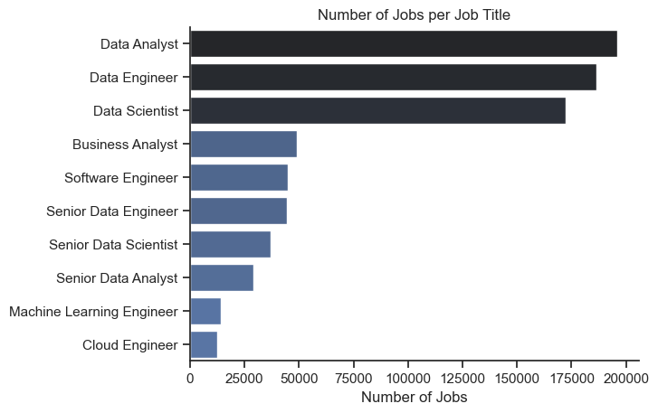
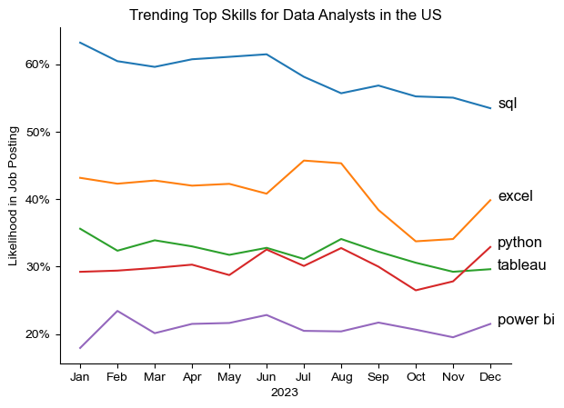
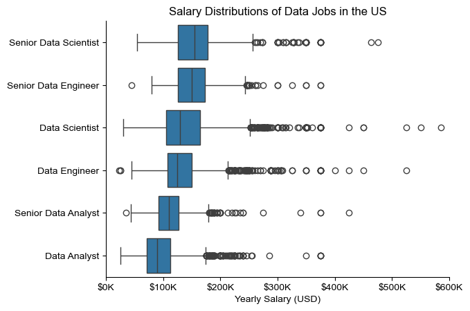
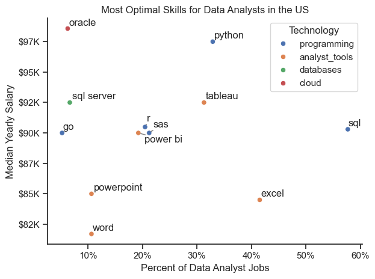

# Australia Data Jobs Market Analysis

End-to-end analysis of the Australian data jobs market using five Jupyter notebooks.
The project focuses on three roles: **Data Analyst**, **Data Scientist**, and **Data Engineer**.

## Project Overview

This project answers five core questions:

1. What does the data jobs landscape in Australia look like?
2. Which skills are most requested across key data roles?
3. How do top skills trend over time?
4. How do jobs and skills compare on salary?
5. Which skills offer the best demand-to-salary tradeoff?

## Notebook Structure

- `1_EDA_Intro_AU.ipynb`: Exploratory analysis of job postings and market composition.
- `2_Skill_Demand_AU.ipynb`: Top skills by role (Data Analyst, Data Scientist, Data Engineer).
- `3_Skills_Trend_AU.ipynb`: Monthly trend analysis for high-demand skills.
- `4_Salary_Analysis_AU.ipynb`: Salary distribution by role and skill.
- `5_Optimal_Skills_AU.ipynb`: Demand vs salary skill prioritization.

## Key Results (Australia)

### Role demand

- Data Engineer: **4,658** postings
- Data Analyst: **1,658** postings
- Data Scientist: **1,179** postings

### Most requested skills by role (posting share)

- **Data Analyst:** SQL (46.50%), Python (26.24%), Power BI (23.94%), Excel (23.28%), Tableau (19.90%)
- **Data Scientist:** SQL (47.24%), Python (46.56%), R (26.46%), AWS (18.15%), Azure (16.45%)
- **Data Engineer:** SQL (62.56%), Python (51.27%), Azure (38.41%), AWS (37.61%), Spark (24.84%)

### Demand vs salary (combined 3 roles, salary subset)

Using thresholds (`skill_percent > 5` and `skill_count >= 8`) to keep the plot readable and reliable, the key skills are:

- SQL (78.05%, median salary $116,750)
- Python (68.29%, median salary $119,250)
- AWS (36.59%, median salary $125,000)
- Azure (34.15%, median salary $100,354)
- Snowflake (21.95%, median salary $100,500)

### Salary insight (Data Analyst, Australia)

- Salary-reported Data Analyst postings are very limited in this dataset, so one-off skills can distort rankings.
- Notebook 4 now applies minimum posting thresholds to avoid one-posting outliers in salary skill charts.

## Selected Visualizations

### Market and Role Demand


### Skill Demand by Role


### Skill Trends Over Time


### Salary Distribution by Role


### Optimal Skills: Demand vs Salary


## Tech Stack

- Python
- Pandas
- Matplotlib
- Seaborn
- Jupyter Notebook
- Hugging Face `datasets`

## Setup

```bash
pip install pandas matplotlib seaborn datasets jupyter adjustText
```

Then start Jupyter and run notebooks in sequence.

## Reproducibility

1. Open notebooks in order from `1` to `5`.
2. Run all cells to regenerate tables and charts.
3. Use notebook 5 to identify practical upskilling priorities based on both demand and pay.

## Data Freshness and Limitations

- This dataset covers job postings from **2023-01-01 to 2023-12-31** only.
- Treat this project as a **historical baseline** of the Australia data-jobs market, not a live market feed.
- Directional insights (for example, SQL/Python demand) are useful, but exact counts and salaries can shift over time.
- Salary analysis is based only on postings with reported salary values, so results are sample-dependent.

## Acknowledgment

- Data source and original project foundation: **Luke Barousse**.
- Original dataset: `lukebarousse/data_jobs`.
- This repository is an adapted Australia-focused version with additional cleanup, bug fixes, and presentation refinements.

